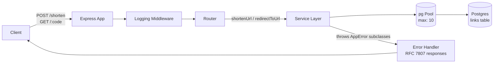

# URL Shortener

A backend-focused URL shortener built as a systems-design learning project (Phase 1 build). The goal wasn't just a working shorten/redirect API — it was to practice data modeling, API contract design, structured error handling, testing discipline, and load-testing methodology on a small, well-understood system before applying the same habits to larger builds.

## Features

- `POST /shorten` — submit a long URL, get back a short one
- `GET /:code` — redirect to the original URL
- Short codes expire after 72 hours (`410 Gone` once expired)
- Per-link `accessed_count`, incremented only on a successful redirect
- Collision-safe short code generation (unique constraint + automatic retry)
- Structured JSON request logging (method, path, status, latency)
- RFC 7807 ("Problem Details for HTTP APIs") error responses

## Stack

- Node.js, TypeScript, Express 5
- PostgreSQL (`pg` driver, no ORM — raw SQL with parameterized queries)
- Vitest + Supertest (unit, integration, and route-level tests)
- Docker Compose (local Postgres)
- Autocannon (load testing)

## Architecture



Layering: routes call the service layer directly (no controller layer), the service layer owns all SQL and business rules (validation, expiry, collision retry), and errors are raised as typed exceptions rather than encoded in return values or string messages.

## Data model

```sql
CREATE TABLE links (
    id UUID PRIMARY KEY DEFAULT gen_random_uuid(),
    long_url TEXT NOT NULL,
    short_code TEXT UNIQUE NOT NULL,
    accessed_count INT NOT NULL DEFAULT 0,
    created_at TIMESTAMPTZ NOT NULL DEFAULT now(),
    expires_at TIMESTAMPTZ
);
```

`short_code`'s UNIQUE constraint doubles as the index backing redirect lookups — this is what keeps `GET /:code` fast as the table grows, and it's the mechanism the collision-retry logic relies on (a duplicate insert fails fast at the DB level rather than requiring an app-side existence check first).

## API contract

| Method | Path | Success | Errors |
|---|---|---|---|
| `GET` | `/health` | `200 { status: "ok" }` | — |
| `POST` | `/shorten` | `201` with `{ long_url, short_url, expires_at }` | `400` missing/invalid/non-string URL |
| `GET` | `/:code` | `302` redirect to `long_url` | `400` malformed code, `404` not found, `410` expired |

Errors follow [RFC 7807](https://datatracker.ietf.org/doc/html/rfc7807):
```json
{
  "type": "https://yourapp.dev/errors/short-code-expired",
  "title": "Short code has expired",
  "status": 410,
  "detail": "This short code has expired",
  "instance": "/K91-mPz"
}
```

Every request is logged as one JSON line: `{"method","path","status","latency_ms"}`.

## Error handling design

Errors are modeled as a typed hierarchy (`AppError` base class, one subclass per failure mode — e.g. `ShortCodeExpiredError`, `ShortCodeNotFoundError`) rather than matched by message string. Earlier iterations of this project used `error.message === "..."` comparisons in the route layer, which broke silently on a trailing-space typo — a real bug caught during development. Moving the status code, title, and RFC 7807 `type` onto the error class itself means:
- A single source of truth for what HTTP response a given failure produces.
- Tests assert on `instanceof <ErrorClass>` rather than exact message text, so wording changes to error messages don't break the test suite.
- Express 5's built-in handling of rejected async route handlers means routes don't need manual `try/catch` — thrown errors flow straight to the centralized `errorHandler`.

## Testing

- **Unit tests** — pure logic (`isValidUrl`, `generateShortCode`, `createShortUrl`).
- **Service-level integration tests** — real Postgres (via Docker), covering the happy path, expiry, not-found, malformed input, collision-retry (via `vi.spyOn` forcing a deterministic collision), and `accessed_count` behavior (increments on success, does not increment on expired/not-found).
- **Route-level integration tests** (Supertest) — full HTTP layer: status codes, RFC 7807 response shape, and the 500 fallback path for unclassified errors.
- Tables are truncated after every test (`TRUNCATE ... RESTART IDENTITY CASCADE`) to keep tests order-independent; mocks are restored after each test to prevent cross-test leakage.

## Load testing

Load-tested with `autocannon` at 100 concurrent connections against both the redirect (`GET /:code`) and shorten (`POST /shorten`) routes, against target NFRs of p99 ≤ 90ms (redirect) and p95 ≤ 100ms (shorten).

**Pool size experiment** — tested `max` at 10, 20, and 30 connections on both routes:

| Pool size | Redirect p99 | Redirect max | Shorten p99 | Shorten max |
|---|---|---|---|---|
| 10 | 201ms | 258ms | 237ms | 465ms |
| 20 | 167ms | 268ms | — | — |
| 30 | 197ms | 465ms | 261ms | 592ms |

Raising the pool from 10 → 20 improved tail latency; raising it further to 30 *regressed* tail latency on both routes. This ruled out "just add more connections" as the fix and pointed at contention elsewhere.

**Isolating the real bottleneck** — a bare no-DB route (`GET /ping`) was load-tested under identical conditions (100 concurrent connections) and still showed p99 = 133ms with zero database work involved. This indicates the dominant cost at this concurrency level is Node/Express's own per-connection handling on a single process, not Postgres, the query, or the connection pool — confirmed further by `EXPLAIN ANALYZE` showing the actual redirect query executes in ~1.5ms.

**Caveat:** the load-testing client (autocannon) and the server ran on the same machine, competing for the same CPU cores. Results may not generalize directly to a client/server setup with dedicated resources.

**Decision:** pool size reverted to the default of 10, matching the project's realistic expected load (~0.01 rps per the design doc) rather than the synthetic 100-concurrent test load. The pool-size investigation is documented here rather than reflected in a permanently inflated pool setting.

## Design notes / scope

- No authentication or per-user link ownership — anyone can shorten or access any link (explicit scope decision).
- No deduplication — the same long URL shortened twice produces two distinct short codes, by design (simpler, avoids a second lookup on every write).
- `accessed_count` increments are not wrapped in a transaction with the redirect lookup — an occasional missed increment under a rare failure is an acceptable tradeoff for a non-critical counter (contrast with fund-handling code, which would warrant stronger guarantees).

## Setup

```bash
docker compose up -d
npm install
npm run start
```

Run tests:
```bash
npm run test
```