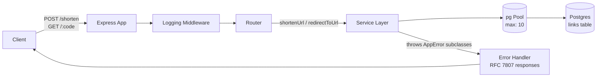

# URL shortener plan

1. **Problem + scope**

   A URL shortener that allows anyone create short URLs, and use them to redirect to original URL. Out of scope: user authentication, user personalisation and associating links with individual users.

2. **Requirements**
   - **Functional:**
     - Users submit a URL and get a shorten one back
     - Users visit a short URL and are redirected to the original URL
     - Short codes expire in 72 hours
   - **Non-Functional:**
     - p95 short code generation latency under 100ms
     - p99 redirect latency of 90ms
     - The system should support 1000 concurrent users
     - 99.9% monthly availability for URL redirection

   **Note:** the 1000-concurrent-user and 99.9%-availability targets are
   aspirational stretch targets for this exercise, not derived from the
   Section 7 scale estimate (~0.01 rps). Designing and load-testing
   against them anyway is intentional — it's a better exercise than
   sizing only for realistic current traffic.

3. **Data flow**

   **Q: What happens when Ada enters a URL to shorten**

   ```html
   Ada ↓ Enter URL ↓ URL shortener Service ↓ Database (to store long URL and
   generated short URL) ↓ Return short URL to Ada
   ```

   **Q: What happens when Ada enters a short URL**

   ```html
   Ada ↓ Enter short URL ↓ URL service ↓ Database (to retrieve the actual URL or
   long URL) ↓ Redirect Ada to actual webpage/URL
   ```

4. **Data model sketch**

   ```
   link (
       id            uuid primary key,
       long_url      text not null,   -- the original URL
       short_code    text unique not null,
       created_at    timestamptz not null default now(),
       expires_at    timestamptz,
       accessed_count int not null default 0
   )
   ```

5. **API contract**

   ```html
   GET /health response: { status: "ok" } POST /shorten body: {"url":
   "https://example.com/very/long/path"} response: {"short_url":
   "https://yourdomain/abc123"} success: 201 errors: 400 if url is
   malformed/missing GET /:code response: redirect to long_url success: 302
   (because of code expiry and analytics) errors: 404 if code doesn’t exist, 410
   if code has expired ** every request should log the method, path, status
   code, and latency in JSON **
   ```

6. **Architecture diagram**



   Notes:
   - The `links` table's `short_code` column is UNIQUE, which doubles as the index backing redirect lookups.
   - Pool size was load-tested at 10/20/30 connections; 10 was retained as the default since it matched real expected traffic (~0.01 rps) and going higher didn't improve — and sometimes worsened — tail latency at high concurrency (see Section 9, Load Testing).

7. **Scale**
   - **Current expected workload**
     - 250 short codes created/day.
     - 750 redirects/day.
     - Read/write ratio: 3:1
     - 0.01157 requests/sec on average
   - **Assumption**
     - Most traffic will be redirects rather than short URL creation.
     - Peak traffic may be significantly higher than the daily average.
8. **Potential bottlenecks**
   1. Database connection pool, Connections might drop because of concurrent read requests
   2. Short-code collision
      - Unique constraint of short_code requires regenerates which might add latency
      - The UNIQUE constraint on short_code doubles as the index that keeps redirect lookups fast as data grows — this is what the p99 90ms target actually depends on.

<!-- npx autocannon -c 100 -d 30 http://localhost:8000/kVBb_6s -->